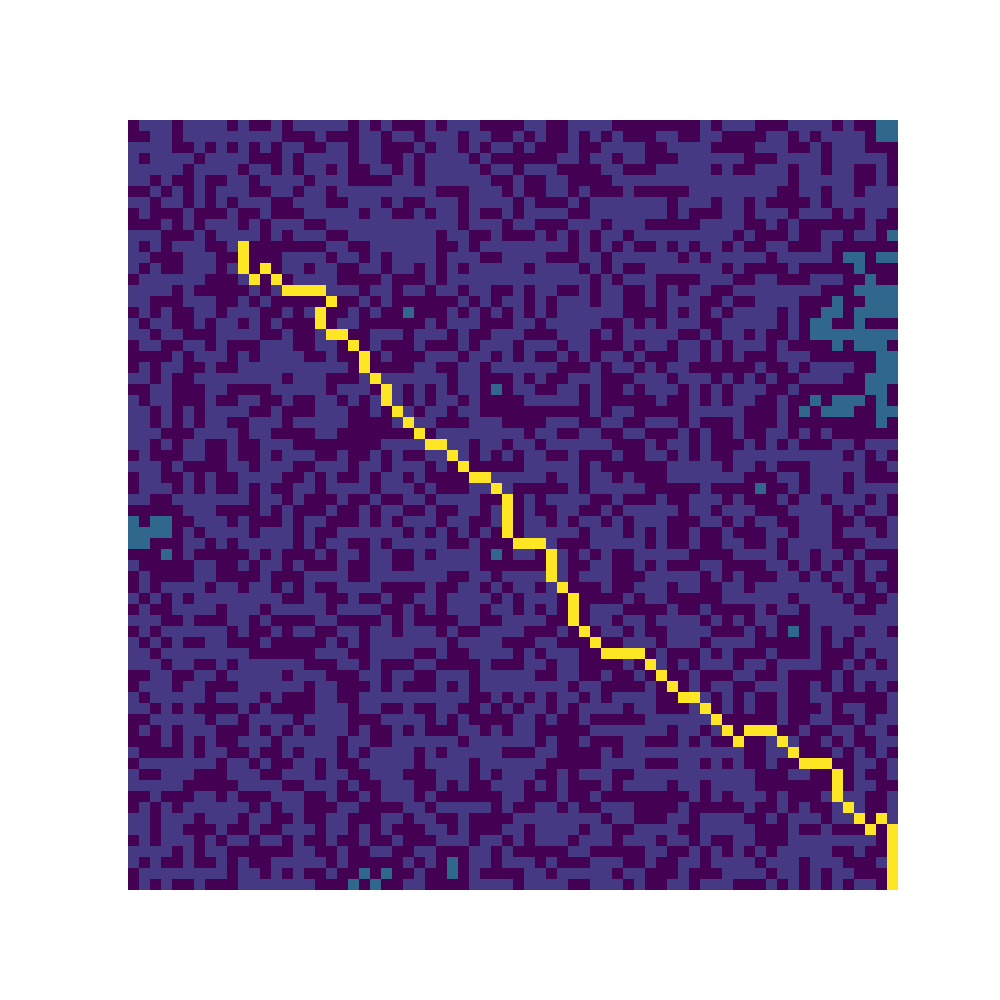
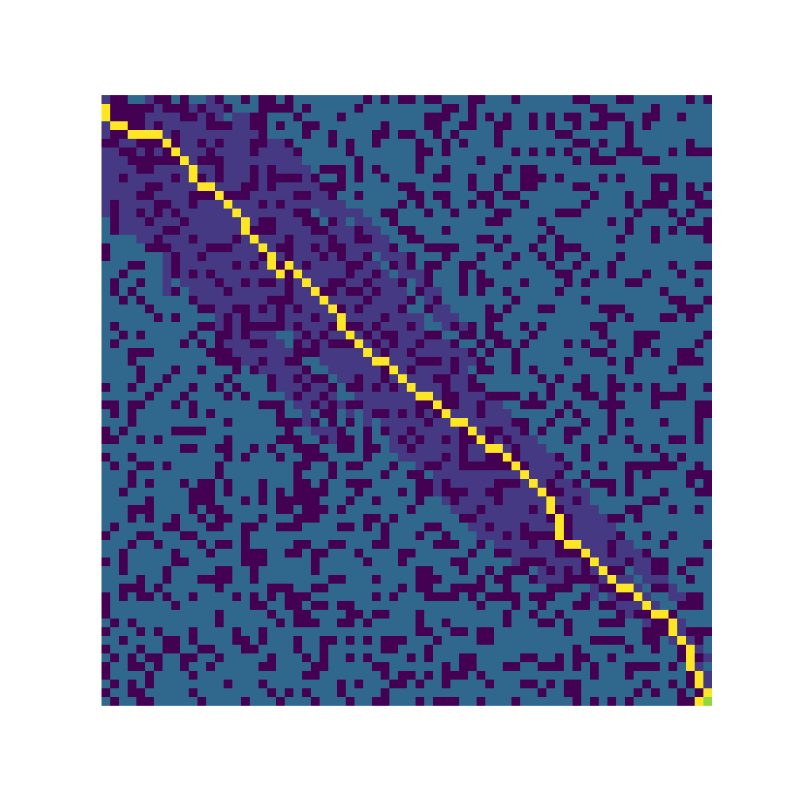

# Visualizing Pathfinding Algorithms

This is a project that implements **A*** and **Dijkstra's** algorithms using Python and Python's libraries Matplotlib.

### How Dijkstra works

Dijkstra’s Algorithm works by visiting vertices in the graph starting with the object’s starting point. It then repeatedly examines the closest not-yet-examined vertex, adding its vertices to the set of vertices to be examined. It expands outwards from the starting point until it reaches the goal. Dijkstra’s Algorithm is guaranteed to find a shortest path from the starting point to the goal, as long as none of the edges have a negative cost.
 
Dijkstra's algorithm uses a data structure for storing and querying partial solutions sorted by distance from the start. While the original algorithm uses a min-priority queue and runs in time ***O((|V| + |E|)log|V|)***, where ***V*** is the number of nodes and ***E*** the number of edges, it can also use an array in time ***O(|V|²)***

##### The Algorithm

```
 1  function Dijkstra(Graph, source):
 2
 3      create vertex set Q
 4
 5      for each vertex v in Graph:            
 6          dist[v] ← INFINITY                 
 7          prev[v] ← UNDEFINED                
 8          add v to Q                     
 9      dist[source] ← 0                       
10     
11      while Q is not empty:
12          u ← vertex in Q with min dist[u]   
13                                             
14          remove u from Q
15         
16          for each neighbor v of u:           // only v that are still in Q
17              alt ← dist[u] + length(u, v)
18              if alt < dist[v]:              
19                  dist[v] ← alt
20                  prev[v] ← u
21
22      return dist[], prev[]
```

##### Sample result

Dijkstra pathfinding result



### How A* works

**A*** is like Dijkstra’s algorithm in implementation, and is usually the most popular choise when it comes to pathfinding. It uses [heuristic](http://theory.stanford.edu/~amitp/GameProgramming/Heuristics.html) to guide itself. At each iteration of its main loop, A* needs to determine which of its paths to extend. It does so based on the cost of the path and an estimate of the cost required to extend the path all the way to the goal. Specifically, A* selects the path that minimizes ***f(n)=g(n) + h(h)***, being *n* the next neighbour of the current node *u*, *g(n)* the cost to get from *source* to *n* and *h(n)* the *heuristic* that estimates the shortest path between *n* and the *end*.

As Dijkstra, **A*** typically implements a min-priority-queue to retrieve the minimum cost of nodes. The priority queue is know as ***open set***. At each step, the node with minimum value is removed from the queue

##### The Algorithm

```
function reconstruct_path(cameFrom, current)
    total_path := {current}
    while current in cameFrom.Keys:
        current := cameFrom[current]
        total_path.prepend(current)
    return total_path

function A_Star(start, goal, h)
    openSet := {start}
    
    cameFrom := an empty map
    
    gScore := map with default value of Infinity
    gScore[start] := 0

    fScore := map with default value of Infinity
    fScore[start] := h(start)

    while openSet is not empty
        current := the node in openSet having the lowest fScore[] value
        if current = goal
            return reconstruct_path(cameFrom, current)

        openSet.Remove(current)
        for each neighbor of current
            
            tentative_gScore := gScore[current] + d(current, neighbor)
            if tentative_gScore < gScore[neighbor]
               
               cameFrom[neighbor] := current
                gScore[neighbor] := tentative_gScore
                fScore[neighbor] := gScore[neighbor] + h(neighbor)
                if neighbor not in openSet
                    openSet.add(neighbor)

    return failure
```

##### Sample result

A* pathfinding result


